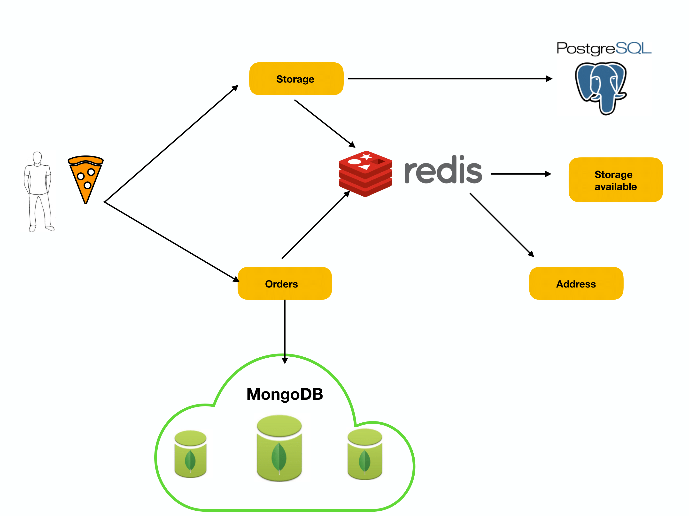

# microservice-architecture
Example micro services architecture, with docker, flask, mongodb, redis, postgres
## Services

## Running examples
First you need to start microservices
```sh
$ docker-compose build
$ docker-compose up
```

For the microservice 'orders' to work correctly, you must configure mongo replication. Enter line by line:
```sh
$ docker-compose exec db-1 mongo
config={_id:"rs0",members:[{_id:0,host:"db-1:27017"},{_id:1,host:"db-2:27017"},{_id:2,host:"db-3:27017"}]};
rs.initiate(config)
```
Then you can open microservices in your browser. 
Ports:
- Orders:5000
- Address:8082
- Storage:8080
- Update:8081
If you use the Docker toolbox then instead of localhost your ip is 192.168.99.100
